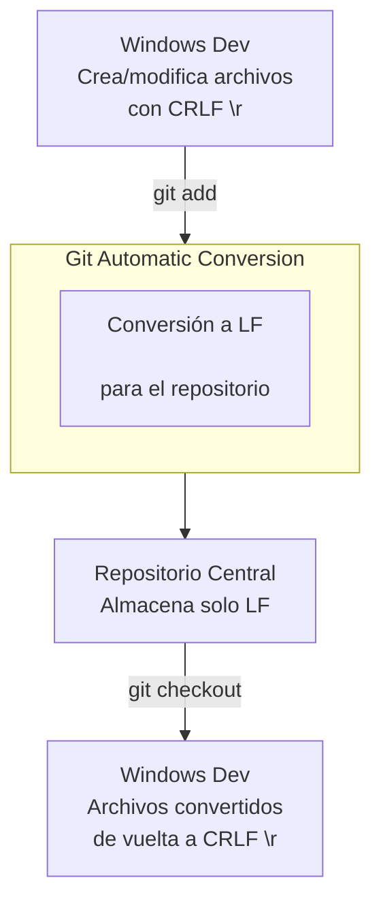

- Tags: #CoreAutocrlf
# El Problema: Fin de Línea (Line Ending)
Diferentes sistemas operativos usan caracteres distintos para representar un "salto de línea" en un archivo de texto:
**`git config --global autocrlf`** es una configuración crucial para **evitar problemas** cuando se trabaja en proyectos con colaboradores que usan **diferentes sistemas operativos** (Windows, Linux, Mac).
*   **Windows:** Usa `CRLF` (Carriage Return + Line Feed → `\r\n`)
*   **Linux / Mac (modernos):** Usan `LF` (Line Feed → `\n`)
Si una persona en Windows y otra en Linux editan el mismo archivo, Git podría detectar cambios en **todas las líneas** aunque el contenido real sea el mismo, solo porque los saltos de línea son diferentes. Esto ensucia el historial de cambios y causa conflictos innecesarios.
#### La Solución: `core.autocrlf`
Esta configuración le dice a Git que **normalice automáticamente** los fines de línea para ti.

#### Valores Principales y Cuándo Usarlos:

| Valor       | Recomendado para...       | Qué hace                                                                                                                                                      |
| :---------- | :------------------------ | :------------------------------------------------------------------------------------------------------------------------------------------------------------ |
| **`true`**  | **Usuarios de Windows**   | Al **guardar** (git add), convierte `LF` → `CRLF` en tu directorio de trabajo. <br> Al **subir** al repositorio, convierte `CRLF` → `LF` (guarda siempre LF). |
| **`input`** | **Usuarios de Linux/Mac** | Al **guardar**, deja los `LF` como están. <br> Al **subir** al repositorio, convierte `CRLF` → `LF` (guarda siempre LF).                                      |
| **`false`** | **Casos muy específicos** | Desactiva la conversión. Los archivos se guardan tal cual. **No recomendado** para proyectos multi-plataforma.                                                |

#### ¿Cómo Configurarlo?
**Para Windows:**
```bash
git config --global core.autocrlf true
```
**Para Linux o macOS:**
```bash
git config --global core.autocrlf input
```

#### Flujo Visual de cómo funciona `core.autocrlf true` (Windows)
El siguiente diagrama ilustra el proceso de conversión automática:



#### ¿Por qué es una configuración global (`--global`)?
Porque está directamente relacionada con **tu sistema operativo local** y tu entorno de trabajo, no con un proyecto específico. Es una de las primeras configuraciones que deberías hacer después de instalar Git.
### Buenas Prácticas Adicionales
Para mayor robustez, los proyectos suelen incluir un archivo **`.gitattributes`** en la raíz del repositorio. Este archivo define reglas de conversión para todos los colaboradores, independientemente de su configuración local.
**Ejemplo de contenido en `.gitattributes`:**
```git
# Todos los archivos de texto se normalizan a LF
# y se les asigna el tipo texto
* text=auto

# Paracederos binarios, no tocar
*.png binary
*.jpg binary
```
**Conclusión:** Configurar `core.autocrlf` correctamente es **esencial** para la colaboración multi-plataforma. Te evita el famoso problema de _"todo el archivo aparece como modificado"_ sin que hayas cambiado una sola línea de código real.