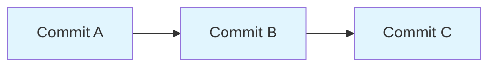
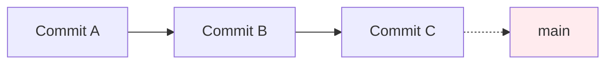
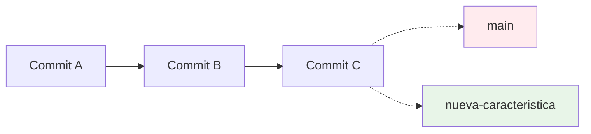
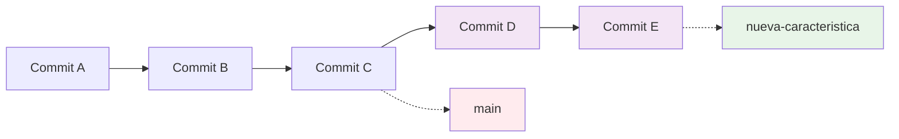

- Tags: #Branches #Ramas

# Ramas (Branches) en Git

#### ¿Qué es una rama?
Una **rama** en Git es simplemente un **puntero móvil** a un commit específico. Es una línea de desarrollo independiente que te permite trabajar en características, fixes o experimentos sin afectar la línea principal de código.
##### Concepto Fundamental: Los commits son la base

Cada commit apunta a su commit padre, formando una **línea de tiempo** del proyecto.

---
#### ¿Cómo funcionan las ramas?

##### 1. La rama principal (main/master)

- `main` es un **puntero** que siempre apunta al último commit estable
- Es la línea de desarrollo principal

- Para ver la rama principal:
```bash
git branch
```
##### 2. Crear una nueva rama
```bash
# El nombre de las ramas usa el convenio Kebapcase, todo en miniscual separado por guiones medios
git branch nueva-caracteristica
```

- Se crea un **nuevo puntero** que apunta al mismo commit actual
- No se copian archivos, solo se crea una referencia
##### 3. Trabajar en la rama
```bash
git switch nueva-caracteristica # Nuevo, Recomendado, Especifico para movernos entre ramas
git checkout nueva-caracteristica # Mas antiguo, No recomendado
# Hacer cambios y commits...
```

- La rama `nueva-caracteristica` avanza con nuevos commits
- La rama `main` se mantiene intacta en el commit C3
---
#### Estructura interna de las ramas
##### Los archivos clave en `.git/`:
```
.git/
├── HEAD                  # Apunta a la rama actual
├── refs/
│   ├── heads/           # Ramas locales
│   │   ├── main
│   │   └── feature-x
│   └── remotes/         # Ramas remotas
│       └── origin/
│           ├── main
│           └── feature-x
```
##### ¿Qué contiene un archivo de rama?
El archivo `.git/refs/heads/main` contiene:
```
a1b2c3d4e5f6... (hash del commit)
```
---
#### Flujo de trabajo típico

##### 1. Crear y cambiar a rama
```bash
git checkout -b mi-feature # No recomendado
git switch -c mi-feature # Recomendado
```
##### 2. Trabajar normalmente
```bash
git add .
git commit -m "Add new feature"
```
##### 3. Integrar cambios (merge)
```bash
git switch main
git merge mi-feature
```
##### 4. Eliminar rama (opcional)
**Nota** Para poder eliminar una rama, Primero necesitamos estar en la rama principal: **main**, Cambiandonos con: **swith**
```bash
git branch -d mi-feature
```

##### 5. Modificar Nombre rama:
**Nota** NO aplicar a la rama en uso actualmente
```bash
# Aplicar solo si estamos en una rama distinta a la que queremos cambiar.
git branch -m nombre_rama nuevo_nombre_rama
```

##### 6. Modificar rama actual en uso:
Solo necesitamos indica el nuevo nombre
**Nota** Si la rama ya esta en un repositorio remota, tenemos que agregar los cambios al repositorio remoto
```bash
git branch -m nuevo_nombre
```
---
#### Beneficios de usar ramas

##### Aislamiento
- Experimentar sin riesgo
- Desarrollar features en paralelo
- Fixear bugs sin afectar desarrollo principal
##### Trabajo en equipo
- Múltiples desarrolladores pueden trabajar simultáneamente
- Conflictos se resuelven de manera controlada
##### Continuous Integration
- Testing de features individuales
- Deployments selectivos
- Code reviews específicos
---
#### Modelos de ramas populares

##### Git Flow
```
main -> develop -> feature/*
           ├── release/*
           └── hotfix/*
```
##### GitHub Flow
```
main -> feature/* -> PR -> merge
```
##### Trunk Based Development
```
main -> short-lived feature branches
```
---
#### Puntos clave
1. **Las ramas son punteros lógicos**, no copias físicas
2. **Crear ramas es rápido y barato** en términos de espacio
3. **Git optimiza el almacenamiento** compartiendo commits entre ramas
4. **El merging une líneas de desarrollo** diferentes
5. **HEAD es el puntero** que indica dónde estás trabajando actualmente