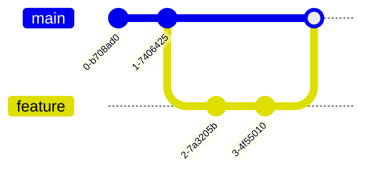
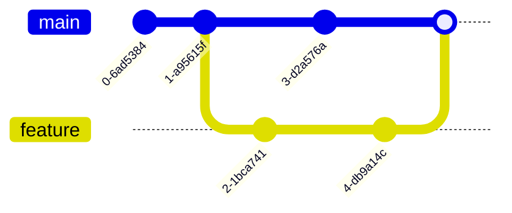
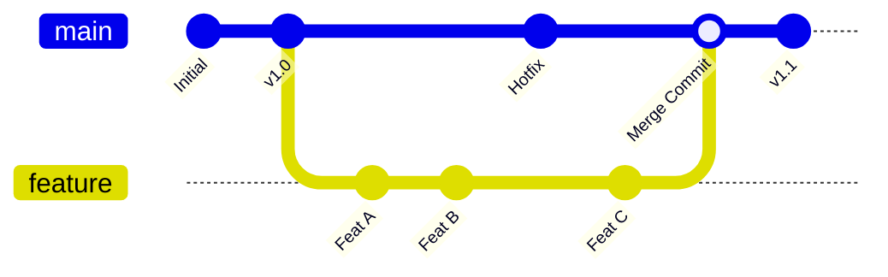

- Tags: #Merge

# `git merge` - Fusionar Ramas

#### ¿Qué es `git merge`?
Es el comando que **integra cambios** de una rama a otra. Combina líneas de desarrollo separadas en una sola.
**Nota** Una ves creada la rama y terminando de modificarla, Tenemos que agregar los cambios y realizar el commit.
Luego ejecutamos para ver los ultmos cambios:
```bash
git log --oneline
```

#### Tipos de Merge

##### 1. Fast-Forward Merge (Avance Rápido)
Ocurre cuando la rama de destino está **directamente detrás** de la rama que quieres mergear.


##### 2. 3-Way Merge (Merge de Tres Vías)
Ocurre cuando ambas ramas tienen **commits divergentes**. Git crea un **nuevo commit de merge**.

##### 3. Merge con Conflictos
Cuando Git no puede fusionar automáticamente porque hay **cambios contradictorios** en la misma parte del código.

---
#### Comandos Esenciales

##### Merge básico
**Nota** Primero nos movemos en la rama principal: **( main/master )**
```bash
git switch main          # Cambia a la rama de destino
git merge feature-branch   # Fusiona la rama source
```

**Nota** En caso de fusionar mal, Podemos regresar a un estado anterio con **reset** y le pasamos el hash del **commit** al que queremos volver y una ves terminado podemos eliminar la rama
##### Ver historial de merges
```bash
git log --oneline --graph --all
```
##### Abortar merge (cuando hay conflictos)
```bash
git merge --abort
```
---
#### Resolución de Conflictos

##### 1. Identificar archivos con conflictos
```bash
git status
# "Both modified: archivo.txt"
```
##### 2. Editar archivos conflictivos
Git marca los conflictos:
```python
<<<<<<< HEAD
Código de la rama actual (main)
=======
Código de la rama que mergeas (feature)
>>>>>>> feature-branch
```
##### 3. Resolver manualmente
Eliminar marcadores y dejar el código correcto.
##### 4. Completar el merge
```bash
git add .                 # Marcar conflictos resueltos
git commit               # Crear commit de merge
```

---

#### 🎯 Estrategias de Merge

##### Recursive (Por defecto)
```bash
git merge -s recursive feature
```
##### **Ours** (Ignora cambios de la otra rama)
```bash
git merge -s ours feature
```
##### **Theirs** (Usa cambios de la otra rama)
```bash
git merge -s theirs feature
```
---
---
#### Buenas Prácticas

##### Antes de mergear
```bash
git fetch origin           # Actualizar referencias remotas
git diff main..feature    # Ver qué se va a mergear
```
##### Merge seguro
```bash
git checkout main
git pull origin main      # Actualizar local con últimos cambios
git merge feature
```
##### Después del merge
```bash
git push origin main      # Subir cambios
git branch -d feature     # Eliminar rama local (opcional)
```
---
---
## 📊 Flujo Visual de Merge



**¡Recuerda:** Siempre haz merge a una rama estable y prueba los cambios antes de hacer push! 🧪
