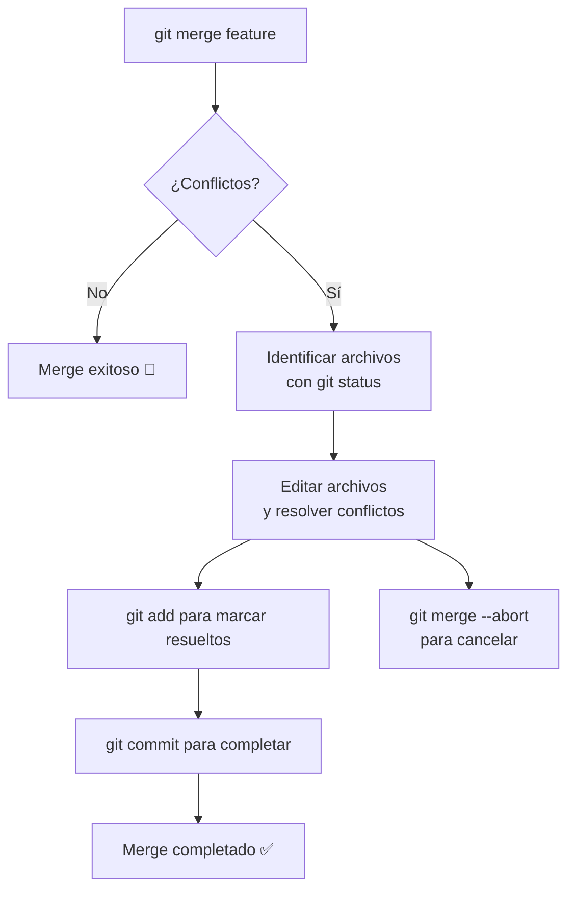

- Tags: #Conflicts

# ⚔️ `git merge` - Conflictos y Resolución

#### ¿Qué es un conflicto de merge?
Ocurre cuando **Git no puede fusionar automáticamente** porque hay cambios contradictorios en la misma parte del código en ambas ramas.

#### Causas comunes de conflictos

##### 1. Cambios en la misma línea
```python
# Rama A: 
print("Hola mundo")

# Rama B:
print("Hello world")
```
##### 2. Archivos eliminados/modificados
- Una rama elimina un archivo
- La otra rama modifica el mismo archivo
##### 3. Cambios adyacentes
- Modificaciones muy cercanas en el mismo archivo
---
#### Comandos para manejar conflictos

### Identificar conflictos
```bash
git status
# Muestra "Both modified:" para archivos conflictivos

# Si nos queremos quedar con ambos cambios fusionados, ejecutamos
git merge --continue
```
##### Abortar merge
```bash
git merge --abort
# Vuelve al estado anterior al merge
```
##### Continuar después de resolver
```bash
git add .                 # Marca conflictos como resueltos
git commit               # Completa el merge
```
---
---
##### Herramientas visuales
```bash
git mergetool           # Abre herramienta visual de merge
git mergetool --tool=vimdiff  # Especificar herramienta
```
##### Herramientas populares:
- **VS Code**: `code --wait`
- **meld**: `git mergetool --tool=meld`
- **kdiff3**: `git mergetool --tool=kdiff3`
- **vimdiff**: `git mergetool --tool=vimdiff`

---
---
## Tips

##### Ver diferencias antes de mergear
```bash
git diff main..feature    # Ver qué cambiará
```
##### Testear después de resolver
```bash
git merge feature
# Resolver conflictos
npm test                 # Ejecutar tests
git commit              # Confirmar si tests pasan
```
##### Ver historial de conflictos
```bash
git log --oneline --merge
```
##### Merge más seguro
```bash
git merge --no-commit feature  # Merge sin commit automático
# Verificar que todo funciona
git commit                    # Commit manual
```

---
---

## 📊 Flujo completo de resolución



**¡Recuerda:** Los conflictos son normales. Indican que múltiples personas trabajan activamente en el proyecto. La comunicación con tu equipo es clave para resolverlos eficientemente!