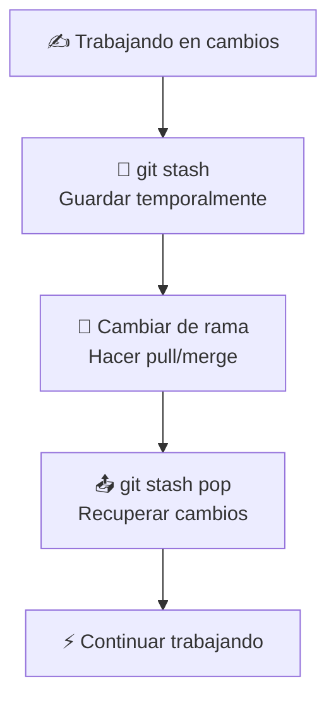

- Tags: #stash #stashpop
---
# `git stash` - Guardar Cambios Temporalmente
**Guarda tus cambios no commiteados** temporalmente para poder cambiar de rama o hacer otras operaciones sin perder tu trabajo.

---
#### Comandos Esenciales

##### Guardar cambios temporalmente:
```bash
git stash
```
##### Guardar con nombre descriptivo:
```bash
git stash push -m "Mi trabajo a medio hacer"
```
##### Recuperar cambios guardados:
```bash
git stash pop
```
##### Listar todos los stashes:
```bash
git stash list
```
##### Eliminar stash específico:
```bash
git stash drop stash@{0}
```

---
#### Casos de Uso Comunes

##### Cambiar de rama urgentemente:
```bash
# Trabajando en algo...
git stash        # Guardar cambios
git switch main  # Cambiar a otra rama
# Hacer cosas en main...
git switch mi-rama
git stash pop    # Recuperar cambios
```

##### Actualizar desde remoto:
```bash
git stash        # Guardar cambios
git pull origin main  # Actualizar
git stash pop    # Recuperar cambios y resolver conflictos
```

##### Probar algo rápido:
```bash
git stash        # Guardar cambios actuales
# Probar algo experimental...
git stash pop    # Volver a mi trabajo
```

---
---
#### ¿Qué se guarda y qué no?

##### Sí se guarda:
- Cambios en tracked files (modificados)
- Archivos nuevos staged (`git add`)
##### No se guarda:
- Archivos no trackeados (nuevos sin `git add`)
- Archivos ignorados en `.gitignore`
---
#### Flujo Visual



